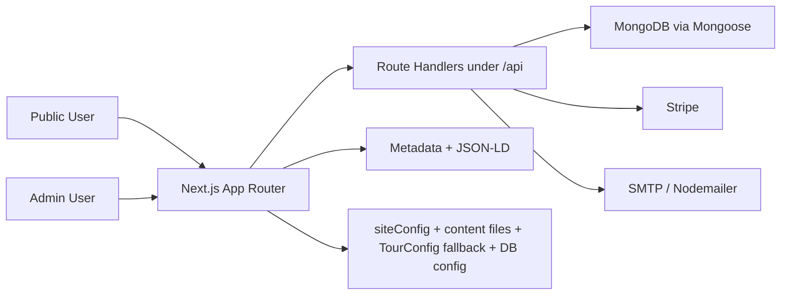

# Website Audit

Date: 2026-05-01 (second pass)
Project: `bot` / `sachsenhausentour.de`
Scope: current-state audit of security, architecture, code redundancy, configuration drift, SEO/schema consistency, and operational health

This report reflects the codebase as it exists now. It does not re-open already-fixed issues unless they still create residual risk through adjacent duplication or drift.

## Executive Summary

The site is materially healthier than the first audit pass. Payment verification is in place, the hardcoded admin seed password is gone, booking mutations are now admin-gated, pricing is partially centralized in Mongo-backed `TourConfig`, and the project builds and tests successfully.

The remaining problems are not cosmetic. The biggest open risk is still booking correctness under concurrency: slot capacity is checked before payment, but not reserved or enforced atomically when the booking is finalized. The second major class of problems is boundary weakness: several server write paths still accept raw bodies or raw update objects, with missing schema validation and missing `runValidators` on Mongoose updates. The third large class is source-of-truth drift: runtime pricing improved, but metadata, structured data, content files, admin defaults, confirmation UX, and static config still disagree in multiple places.

No currently confirmed critical issue was found in this pass, but there are three high-severity items and a broad medium-severity backlog that affects correctness, SEO trustworthiness, maintainability, and operational resilience. A notable new finding is that displayed pricing tiers (Student, Group 8+) are purely cosmetic — the checkout always charges the flat adult price regardless of guest type, creating a gap between advertised and actual pricing.

## Validation Snapshot

Commands run during this audit:

| Command | Result |
| --- | --- |
| `npm test` | Passed, `73/73` tests |
| `npm run lint` | Passed with `9` warnings, `0` errors |
| `npm run build` | Passed; Next 16 warns that `middleware` is deprecated and should move to `proxy` |
| `npm audit --json` | `2` moderate vulnerabilities in `next -> postcss` (`GHSA-qx2v-qp2m-jg93`) |

Build output also confirms a mixed rendering model:

- Dynamic routes: `/`, `/book`, `/es`, `/tour`, `/blog/[slug]`, all API routes
- Static routes: `/about`, `/blog`, `/contact`, `/gallery`, `/book/confirmation`, `/blog/concentration-camp-berlin`, `/blog/sachsenhausen-tour-berlin-journey`, `/blog/what-to-expect-sachsenhausen-tour`
- Next still reports `Proxy (Middleware)`, while the source file remains `src/middleware.ts`

## Severity Summary

### Critical

- No confirmed critical findings in the current codebase

### High

1. Non-atomic booking capacity enforcement can still oversell the same slot
2. Server-side mutation validation remains weak across key admin and booking write paths
3. Business configuration is only partially centralized; source-of-truth drift remains across runtime config, metadata, content, schema output, and admin defaults

### Medium

0. Pricing tiers are display-only — checkout always charges flat `pricePerPerson` regardless of guest type
1. Booking finalization is still duplicated across multiple paths; valid `paymentId` replay resends emails; confirm returns 200 on failure; webhook path never sends emails
2. RBAC is inconsistent across `/admin` pages and `/api/admin/*` read routes
3. Login and public booking endpoints have no visible throttling or abuse controls
4. Post-login redirect handling is unsanitized
5. The public confirmation page is not authoritative
6. Date formats remain inconsistent between booking storage, reporting, and admin UX
7. Active `TourConfig` selection still depends on loose singleton enforcement
8. Security headers exist, but the CSP is still permissive and the app has not migrated from `middleware` to `proxy`
9. Structured data and metadata are duplicated and contradictory
10. Blog routing, draft handling, and indexability are inconsistent
11. Locale support, legal navigation, and public IA are incomplete
12. The dependency tree still carries a moderate advisory through `next` and bundled `postcss`

### Low

1. The section/content architecture is only partially adopted and now carries dead paths
2. Several dependencies appear unused
3. Minor platform redundancies remain in auth, Stripe config, and link handling
4. Repo documentation is stale and contradicts the actual application structure

## Audit Method

This report is based on:

- direct code inspection of the booking, auth, admin, config, SEO, and content layers
- route/build validation through `npm run build`
- code health checks through `npm run lint` and `npm test`
- dependency vulnerability scan through `npm audit --json`
- local Next 16 documentation review under `node_modules/next/dist/docs/` for `proxy` and CSP behavior

## Architecture Snapshot

The important architectural fact is that the app is no longer purely static-content-driven and is no longer purely config-driven either. It is a hybrid:

- live booking and pricing behavior reads `TourConfig` from MongoDB
- public marketing copy still comes from large static content files
- several metadata and schema layers still contain hardcoded values
- admin routes write directly to Mongo-backed config without a strict validation boundary
- confirmation UX still trusts client-side query params instead of a server-fetched booking record

That hybrid state is the source of most remaining drift.

## Detailed Findings

## High 1. Slot capacity can still be oversold under concurrency

Evidence:

- `src/app/api/checkout/route.ts:63-87`
- `src/app/api/checkout/route.ts:93-107`
- `src/app/api/checkout/confirm/route.ts:185-203`
- `src/app/api/webhook/route.ts:37-53`

What is happening:

- The checkout route aggregates existing confirmed guests for `tourDate + tourTime`.
- If there appears to be room, it creates a Stripe PaymentIntent.
- No slot reservation is created.
- No atomic decrement or transactional enforcement exists when the booking is actually written.
- Both the confirm route and webhook can write the booking after payment succeeds, but neither rechecks capacity atomically against a shared inventory record.

Why this matters:

- Two users can pass the same capacity check at the same time.
- Both can pay successfully.
- Both bookings can be finalized.
- `maxGuestsPerSlot` becomes advisory rather than enforced.

Risk:

- High business correctness risk
- Customer support and refund burden
- Loss of operator trust in booking totals

Recommended fix:

- Introduce a slot inventory model or reservation model with expiry.
- Recheck and claim inventory inside a transaction during booking finalization.
- Make final booking creation single-path and authoritative.

## High 2. Server-side mutation validation is still too weak

Evidence:

- `src/app/api/admin/tours/route.ts:19-28`
- `src/app/api/admin/tours/[id]/route.ts:27-45`
- `src/app/api/admin/users/[id]/route.ts:16-35`
- `src/app/api/admin/bookings/[id]/route.ts:49-109`
- `src/app/api/checkout/confirm/route.ts:185-203`

What is happening:

- `POST /api/admin/tours` passes the entire request body directly into `TourConfig.create(body)`.
- `PATCH /api/admin/tours/[id]` passes the entire request body into `findByIdAndUpdate(id, body, { new: true })`.
- `PATCH /api/admin/users/[id]` and `PATCH /api/admin/bookings/[id]` do some field selection, but update through `findByIdAndUpdate()` without `runValidators: true`.
- `POST /api/checkout/confirm` uses `findOneAndUpdate(..., { upsert: true, new: true })` without validators.
- No route-boundary Zod or equivalent schema layer was found.

Why this matters:

- Mongoose schemas do not protect update paths as strongly as many teams assume.
- Incorrect blackout dates, invalid roles, malformed time slots, bad pricing data, or unexpected fields can still enter the database.
- The admin UI currently sends whole objects back to the server, which amplifies accidental mutation risk.

Risk:

- High integrity risk
- High maintenance risk
- Medium-to-high security risk through unexpectedly permissive update surfaces

Recommended fix:

- Add explicit request schemas per route.
- Reject unknown fields.
- Always use `runValidators: true` on update paths.
- Prefer minimal patch payloads over whole-object replacement.

## High 3. Source-of-truth drift is still a systemic problem

Evidence:

- `src/lib/tour-config.ts:31-52`
- `src/config/site.ts:15-22`
- `src/app/layout.tsx:24-30`
- `src/app/(site)/page.tsx:33-36`
- `src/app/(site)/book/page.tsx:24-33`
- `src/app/(site)/es/page.tsx:25-35`
- `src/content/en/book.ts:74-80`
- `src/content/en/book.ts:154-161`
- `src/content/en/home.ts:9`
- `src/content/en/home.ts:140-142`
- `src/components/seo/OrganizationSchema.tsx:11-47`
- `src/components/seo/TourSchema.tsx:10-54`
- `src/app/admin/(dashboard)/tours/page.tsx:66-88`

What is happening:

- Runtime booking price now comes from Mongo-backed `TourConfig`, which is good.
- But fallback config, `siteConfig`, page metadata, content files, schema components, admin create defaults, confirmation page copy, and some component defaults still carry business values independently.
- `siteConfig.booking` still owns `departureTime`, `duration`, `meetingPoint`, and `meetingAddress`.
- `TourConfig` only owns `meetingPoint`, not `meetingAddress`.
- `TourSchema` still hardcodes `validFrom: '2024-01-01'`.
- `bookContent` still contains a legacy WooCommerce product URL and a second time slot that the live config may not expose.

Why this matters:

- Pricing centralization improved one domain, but the broader business model is still split.
- Operators can update the live tour config and still leave public metadata, schema, email content, confirmation details, and static pages partially stale.
- Failover to fallback config is operationally useful, but it is also a second business source of truth.

Risk:

- High correctness and trust risk
- Persistent SEO/data mismatch risk
- High maintenance overhead

Recommended fix:

- Decide which fields are truly runtime-configurable and move all of them into a single authoritative model.
- Keep fallback config intentionally minimal and monitor whenever it is used.
- Remove legacy values from content files once they are no longer the source of truth.

## Medium 0. Pricing tiers are display-only — checkout always charges flat `pricePerPerson`

Evidence:

- `src/app/api/checkout/route.ts:90-91`
- `src/components/sections/BookingSidebar.tsx:95-105`
- `src/components/sections/VisitorInfo.tsx:19-26`
- `src/app/(site)/page.tsx` (hero pricing card)
- `src/app/(site)/es/page.tsx` (Spanish pricing card)
- `src/components/booking/BookingWidget.tsx`

What is happening:

- The frontend displays pricing tiers: Adult €29, Student €24, Group 8+ €22.
- The booking widget does not collect guest type (adult, student, group).
- The checkout API always charges `config.pricePerPerson * guestCount` regardless.
- There is no tier selection anywhere in the payment flow.

Why this matters:

- The displayed pricing promises discounts that the checkout cannot honor.
- Students and groups currently pay the same adult rate.
- This is a customer trust and potential legal issue: advertised prices do not match actual charges.

Recommended fix:

- Add a guest-type selector to the booking widget.
- Pass selected tier to the checkout API.
- Validate the tier server-side against `config.pricingTiers` and calculate the correct per-person price.
- Alternatively, if tier pricing is aspirational, remove the tiers from the frontend until the checkout supports them.

## Medium 1. Booking finalization is still duplicated and valid `paymentId` replay can resend emails

Evidence:

- `src/app/api/checkout/confirm/route.ts:147-156`
- `src/app/api/checkout/confirm/route.ts:165-171`
- `src/app/api/checkout/confirm/route.ts:185-224`
- `src/app/api/webhook/route.ts:33-53`
- `src/app/api/webhook/route.ts:57-67`

What is happening:

- The confirm route verifies the payment with Stripe, upserts a booking, then sends customer and internal emails.
- The webhook also writes bookings on `payment_intent.succeeded`.
- The confirm route falls back to `body.*` if Stripe metadata is missing.
- Nothing marks "emails already sent" for a given payment ID.

Why this matters:

- A valid repeated confirm request can keep triggering side effects.
- Booking logic exists in more than one place and can drift.
- The webhook is verified, but the UX confirmation path still behaves like part of the write pipeline instead of a read-only follow-up layer.

Recommended fix:

- Make the webhook the only authoritative booking finalizer.
- Treat the client-facing confirm endpoint as a status lookup or no-op follow-up.
- Store idempotency state for confirmation emails and internal notifications.

Additional observations on the confirm/webhook split:

1. **Confirm route returns HTTP 200 on catch-all failure**: Line 229 returns `NextResponse.json({ success: false, error: 'Confirmation failed' })` with no explicit status code. The client may interpret this as a successful response. Should return `{ status: 500 }`.

2. **Webhook path creates bookings but never sends emails**: If the client-side confirm call fails (e.g. network timeout after payment succeeds), the webhook will eventually create the booking, but the customer will never receive a confirmation email. The customer has paid, has no email, and has no reliable confirmation page.

3. **Internal email subject contains unescaped user input**: `buildInternalEmail` uses `${booking.name}` directly in the SMTP subject line at line 224. While `esc()` is applied to HTML body content, the email subject can contain arbitrary user-supplied characters, which is a minor header injection surface.

## Medium 2. RBAC is inconsistent across `/admin` pages and admin APIs

Evidence:

- `src/middleware.ts:21-35`
- `src/app/admin/(dashboard)/layout.tsx:9-19`
- `src/components/admin/AdminSidebar.tsx:17-22`
- `src/app/api/admin/bookings/route.ts:6-45`
- `src/app/api/admin/bookings/[id]/route.ts:17-29`
- `src/app/api/admin/stats/route.ts:7-54`
- `src/app/api/admin/tours/route.ts:7-15`
- `src/app/api/admin/tours/[id]/route.ts:11-23`
- `src/app/api/admin/users/[id]/route.ts:11-35`
- `src/lib/admin-auth.ts:1-25`

What is happening:

- Edge protection only checks for the presence of a token.
- The admin layout itself does not enforce role-based access server-side.
- Several admin read routes accept any authenticated user, not just admins.
- `AdminSidebar` always exposes `Bookings`, `Tour Config`, and `Users`.
- The repo already has shared auth helpers in `src/lib/admin-auth.ts`, but routes mostly bypass them and duplicate auth logic inline.

Why this matters:

- Permission boundaries are inconsistent and hard to audit.
- Least-privilege is not clearly defined for `staff` vs `admin`.
- UI and API behavior can diverge.

Recommended fix:

- Define a role/capability matrix.
- Reuse shared helpers consistently.
- Gate admin layout and API routes with the same policy.
- Hide navigation entries a role cannot use.

## Medium 3. Login and public booking endpoints have no visible throttling or abuse controls

Evidence:

- `src/lib/auth.ts:28-79`
- `src/app/admin/login/page.tsx:18-35`
- `src/app/api/checkout/route.ts:12-117`
- `src/app/api/checkout/confirm/route.ts:135-230`

What is happening:

- No rate limiter or lockout behavior is visible in the credentials auth flow.
- No request throttling is visible on checkout creation.
- No request throttling is visible on checkout confirmation.
- The confirm route triggers email side effects on success.

Why this matters:

- Admin login is exposed to brute-force attempts.
- Public booking endpoints can be spammed for email or payment noise.
- Abuse handling is currently delegated entirely to upstream infrastructure, if it exists at all.

Recommended fix:

- Add request throttling by IP/session/email for auth and public write routes.
- Add login backoff or temporary lockout.
- Add observability for repeated failed auth or confirm attempts.

## Medium 4. Post-login redirect handling is unsanitized

Evidence:

- `src/middleware.ts:24-26`
- `src/app/admin/login/page.tsx:10-12`
- `src/app/admin/login/page.tsx:32-34`

What is happening:

- Middleware sets `callbackUrl` from the requested pathname.
- The login page reads `callbackUrl` from search params and pushes it directly with `router.push(callbackUrl)`.

Why this matters:

- Internal middleware currently writes a path-only value, which is safer than a full URL.
- But the login page itself does not validate that the final value is local, expected, or within admin scope.
- Any future code path that injects a broader `callbackUrl` would widen this into a redirect problem immediately.

Recommended fix:

- Only allow local relative paths.
- Prefer an allowlist rooted at `/admin`.

## Medium 5. The confirmation page is not authoritative

Evidence:

- `src/app/(site)/book/confirmation/page.tsx:10-16`
- `src/app/(site)/book/confirmation/page.tsx:25-29`
- `src/app/(site)/book/confirmation/page.tsx:55-72`
- `src/components/booking/CheckoutForm.tsx:88-95`

What is happening:

- The confirmation page renders success details from query params only.
- It does not verify booking existence server-side.
- Users are redirected there from the checkout form with client-assembled query params.

Why this matters:

- Anyone can fabricate a success URL.
- A payment could succeed while email or booking finalization partially fails, and the UI would still appear authoritative.
- The page uses static `siteConfig.booking` values for meeting details and duration instead of live config or a stored booking record.

Recommended fix:

- Render confirmation from a server-fetched booking record keyed by a signed token or payment reference.
- Separate "payment succeeded" from "booking finalized and persisted."

## Medium 6. Date handling is still inconsistent

Evidence:

- `src/components/booking/BookingWidget.tsx:79-86`
- `src/app/api/admin/stats/route.ts:15-32`
- `src/app/admin/(dashboard)/tours/page.tsx:399-416`
- `src/content/en/book.ts:186-191`

What is happening:

- The booking widget now sends ISO dates.
- The stats route still computes `today` as `DD/MM/YYYY` using `toLocaleDateString('en-GB')`.
- The admin tours page still instructs operators to enter blackout dates as `DD/MM/YYYY`.
- Static content still carries manual blackout-like date examples and slot assumptions.

Why this matters:

- Booking storage, blackout logic, and reporting are not using one canonical date representation end-to-end.
- "Today's bookings" can undercount or miss data if stored bookings use ISO.

Recommended fix:

- Normalize persisted booking and blackout dates to ISO only.
- Update admin UX to match the storage format.
- Make reporting derive dates through the same canonical formatter used at write time.

## Medium 7. Active `TourConfig` selection still depends on loose singleton enforcement

Evidence:

- `src/lib/tour-config.ts:59-64`
- `src/app/api/checkout/route.ts:24-27`
- `src/models/TourConfig.ts:74-94`

What is happening:

- Runtime reads still use `findOne({ active: true })`.
- Mongoose hooks attempt to deactivate other active configs on save and `findOneAndUpdate`.
- There is no stronger datastore-level singleton guarantee in the model definition.

Why this matters:

- If multiple active configs appear through direct DB edits, scripts, or races, runtime behavior depends on whichever document `findOne()` returns first.
- The app would still "work," but with ambiguous config selection.

Recommended fix:

- Add a stronger singleton guarantee, ideally at the database/index layer.
- Consider replacing "active row" lookup with a dedicated singleton document.

## Medium 8. CSP is still permissive and the app has not migrated to `proxy`

Evidence:

- `next.config.ts:30-39`
- `src/middleware.ts:5-41`
- build output warning during `npm run build`

What is happening:

- Security headers were added, which is good.
- The CSP still permits `'unsafe-inline'` and `'unsafe-eval'` in `script-src`.
- `img-src` still allows `http:`.
- The app still uses the deprecated `middleware` file convention on Next 16.

Why this matters:

- The current header set is better than none, but it is not yet a strong CSP.
- A nonce- or hash-based CSP is not in place.
- The auth edge layer is sitting on a deprecated convention that the framework explicitly warns about.

Recommended fix:

- Migrate `src/middleware.ts` to `src/proxy.ts`.
- Tighten the CSP for production.
- Remove `unsafe-eval` from production if not required.
- Restrict `img-src` to trusted origins.

## Medium 9. Structured data and metadata are duplicated and contradictory

Evidence:

- `src/components/seo/OrganizationSchema.tsx:11-47`
- `src/app/(site)/about/page.tsx:43-92`
- `src/components/seo/TourSchema.tsx:14-54`
- `src/app/layout.tsx:24-30`
- `src/app/(site)/page.tsx:33-36`
- `src/app/(site)/book/page.tsx:24-33`
- `src/app/(site)/es/page.tsx:25-35`

What is happening:

- The shared `OrganizationSchema` reports rating `4.7` and review count `4363`.
- The About page injects a second organization schema with rating `4.8` and review count `320`.
- Homepage hero copy uses `4.8/5` and `320+ reviews`.
- `ReviewSlider` defaults are `4.7`, `4,363`, `1,667`, and `2,696`.
- Root and page-level metadata still hardcode `€29` in titles/descriptions even though body pricing now comes from DB config.
- `TourSchema` still hardcodes `validFrom: '2024-01-01'` and static itinerary assumptions.

Why this matters:

- Search engines and users are being told different versions of the same business facts.
- Structured data credibility is weakened by internally contradictory rating/review counts.
- Pricing changes can leave metadata stale even when the visible page body is correct.

Recommended fix:

- Define one canonical rating/review source.
- Generate metadata from runtime config where business values are mutable.
- Consolidate organization schema into one shared implementation.

## Medium 10. Blog routing and draft handling are inconsistent

Evidence:

- `src/app/(site)/blog/page.tsx:17-45`
- `src/app/(site)/blog/page.tsx:61-84`
- `src/app/(site)/blog/[slug]/page.tsx:7-15`
- `src/app/sitemap.ts:54-65`
- build output for `/blog/sachsenhausen-tour-berlin-journey` and `/blog/what-to-expect-sachsenhausen-tour`

What is happening:

- The blog index marks two posts as `draft: true` and excludes them from the listing.
- Those same draft posts still exist as built public routes.
- The generic `[slug]` route returns a placeholder page for any slug instead of `notFound()`.
- Sitemap excludes the draft posts, but the routes still ship.

Why this matters:

- Draft/public status is inconsistent.
- Any unknown slug becomes a soft-404 style placeholder page.
- SEO and editorial state do not line up cleanly.

Recommended fix:

- Decide whether blog content is file-routed or data-driven.
- Return `notFound()` for unknown slugs.
- Remove or truly gate draft posts if they should not be public.

## Medium 11. Locale support, legal navigation, and public IA are incomplete

Evidence:

- `src/config/site.ts:7-8`
- `src/config/navigation.ts:23-26`
- `src/app/layout.tsx:39`
- `src/app/sitemap.ts:67-77`
- build route list from `npm run build`

What is happening:

- `siteConfig.locales` includes `en`, `de`, and `es`.
- There is no `/de` route in the built application.
- Footer legal links point to `/imprint` and `/privacy`, but those routes are absent.
- Root metadata fixes locale to `en_US`.
- Sitemap only emits `/es` for localized content.

Why this matters:

- The public IA promises routes that do not exist.
- Locale support is declarative rather than real.
- Legal navigation gaps are especially risky for a public EU-facing tour site.

Recommended fix:

- Either implement the missing routes or remove them from public navigation/config.
- Make locale declarations match the actual route tree.

## Medium 12. Dependency scan still reports a moderate advisory

Evidence:

- `npm audit --json`

What is happening:

- The dependency tree reports `2` moderate vulnerabilities.
- Both are tied to the `next -> postcss` chain.
- The advisory is `GHSA-qx2v-qp2m-jg93` for PostCSS XSS through unescaped `</style>` in stringify output.

Why this matters:

- The app is not currently failing build or test because of this, but the dependency hygiene status is not clean.
- The reported automated fix suggestion is not trustworthy as-is because it points to an unrelated major downgrade path.

Recommended fix:

- Track the upstream Next/PostCSS fix window.
- Upgrade once a safe patched Next version is available.

## Low 1. The section/content architecture is only partially adopted and now carries dead paths

Evidence:

- `CLAUDE.md:10-31`
- `src/components/sections/index.ts:1-12`
- `src/components/sections/BookingSidebar.tsx`
- `src/content/types.ts:216-234`
- `src/app/(site)/page.tsx`
- `src/app/(site)/book/page.tsx`
- `src/app/(site)/about/page.tsx`

What is happening:

- Repo guidance still claims a strict three-layer architecture, thin pages, and no hardcoded strings.
- Actual pages are large assembly files with mixed content, layout, business copy, and runtime data access.
- Multiple section abstractions are exported but not used by the real page tree.
- `BookingSidebar` appears to have no consumers.
- `PageHero`, `TrustBar`, `WhyBook`, `Qualifier`, `GuideVoice`, and `FinalCta` are exported from `src/components/sections/index.ts` but are not used by current pages.
- Content types still model many sections that the live pages no longer render through shared components.

Why this matters:

- The codebase advertises an architecture it no longer follows.
- New contributors cannot tell which abstractions are active and which are legacy.
- Redundant sections and content types make refactors slower and more error-prone.

Recommended fix:

- Choose one direction.
- Either complete the component/content architecture or remove the half-adopted abstractions.

## Low 2. Several dependencies and symbols appear unused

Evidence:

- `package.json`
- no `next-intl` imports found under `src`
- no `framer-motion` imports found under `src`
- `npm run lint` warnings

Current unused/noisy items:

- `next-intl` appears unused
- `framer-motion` appears unused
- `src/components/booking/BookingWidget.tsx:50` unused `checkoutUrl`
- `src/app/(site)/page.tsx:9` unused `Euro`
- `src/app/(site)/es/page.tsx:13` unused `ChevronRight`
- several other low-signal unused imports and one stale eslint-disable remain

Why this matters:

- Dead dependencies enlarge update surface and maintenance burden.
- Small warning piles become background noise and hide future real issues.

Recommended fix:

- Remove unused packages after confirming they are not planned.
- Clear remaining lint warnings.

## Low 3. Small architectural redundancies remain

Evidence:

- `src/lib/admin-auth.ts:1-25`
- `src/lib/auth.ts:28-79`
- `src/lib/stripe.ts:6-19`
- `src/components/booking/StripeProvider.tsx:7-12`
- `src/components/ui/Button.tsx:52-57`

What is happening:

- Shared admin auth helpers exist but are not the primary API guard mechanism.
- Stripe mode selection is duplicated between `src/lib/stripe.ts` and `StripeProvider.tsx`.
- `Button` uses raw `<a>` for links rather than `next/link`, which is not a security problem but is an unnecessary divergence from the rest of the app's routing behavior.

Why this matters:

- These are small examples of the same broader maintainability problem: policy and config are repeated instead of centralized.

Recommended fix:

- Reuse the existing auth helper layer or delete it.
- Centralize Stripe mode selection.
- Align internal link rendering with framework-native navigation.

## Low 4. Repo docs are stale and misleading

Evidence:

- `README.md:1-36`
- `CLAUDE.md:5`
- `CLAUDE.md:16`
- `CLAUDE.md:21-31`

What is happening:

- `README.md` is still the default create-next-app template.
- `CLAUDE.md` still describes the project as "Next.js 14+" while `package.json` is on `next@16.2.3`.
- `CLAUDE.md` says pages should stay under 100 lines and should contain no business logic or hardcoded strings, but the current public pages do not follow that rule.
- `CLAUDE.md` claims locale structure such as `src/content/de/` that is not actually present.

Why this matters:

- The docs encode false assumptions.
- That increases the chance of inconsistent future changes.

Recommended fix:

- Rewrite repo docs to describe the code as it exists now.
- Treat architecture docs as part of the product, not as aspirational notes.

## Inconsistency Inventory

The following inconsistencies are distinct from the security findings and are worth tracking explicitly:

1. Review/social-proof numbers conflict:
   - homepage hero: `4.8/5` and `320+ reviews` in `src/app/(site)/page.tsx:115-116`
   - `ReviewSlider` defaults: `4.7`, `4,363`, `1,667`, `2,696` in `src/components/sections/ReviewSlider.tsx:241-244`
   - shared `OrganizationSchema`: `4.7 / 4363` in `src/components/seo/OrganizationSchema.tsx:40-47`
   - About page schema: `4.8 / 320` in `src/app/(site)/about/page.tsx:67-72`

2. Transport inclusion conflicts:
   - `VisitorInfo` says the guided tour price includes the round-trip S-Bahn journey in `src/components/sections/VisitorInfo.tsx:115-117`
   - homepage content says an ABC zone ticket is required and not included in `src/content/en/home.ts:203-205` and `src/content/en/home.ts:347-348`
   - homepage "Things to Know" tells users to bring a valid ABC zone transit ticket in `src/app/(site)/page.tsx:503-506`
   - book page content also says `ABC ticket required` in `src/content/en/book.ts:80` and `src/content/en/book.ts:146`

3. Pricing is dynamic in the UI body but static in metadata:
   - homepage metadata still includes `€29` in `src/app/(site)/page.tsx:34-36`
   - book page metadata still includes `€29` in `src/app/(site)/book/page.tsx:25-31`
   - Spanish page metadata still includes `€29` in `src/app/(site)/es/page.tsx:26-28`
   - root metadata default still says `from €29` in `src/app/layout.tsx:25-27`

4. Meeting-point authority is split:
   - runtime config includes `meetingPoint` in `src/lib/tour-config.ts:27-29`
   - `siteConfig.booking` still owns both `meetingPoint` and `meetingAddress` in `src/config/site.ts:15-22`
   - confirmation page uses `siteConfig.booking`, not live config, in `src/app/(site)/book/confirmation/page.tsx:55-66`

5. Schedule assumptions conflict:
   - live config supports variable time slots
   - book content still includes `10:30 AM` slot in `src/content/en/book.ts:100-103` and `src/content/en/book.ts:179-184`
   - homepage and other pages still describe departure as fixed daily `10:00 AM`

6. Draft/public blog state conflicts:
   - draft posts excluded from index in `src/app/(site)/blog/page.tsx:61-84`
   - draft pages still ship as built routes
   - generic slug page returns a placeholder for unknown content in `src/app/(site)/blog/[slug]/page.tsx:7-15`

7. Locale declarations do not match actual routes:
   - config claims `de` exists
   - build output shows no `/de`

8. Pricing tier promise vs checkout reality:
   - frontend shows Adult €29, Student €24, Group 8+ €22
   - booking widget has no guest-type selector
   - checkout API charges `pricePerPerson * guests` at `src/app/api/checkout/route.ts:90-91`
   - students and groups currently pay the same adult rate

9. Footer/legal navigation does not match actual app routes:
   - `/imprint` and `/privacy` are linked in `src/config/navigation.ts:23-26`
   - no matching routes were found under `src/app`

## Redundancy Inventory

These are the main redundant systems still increasing maintenance cost:

1. Booking finalization logic:
   - `src/app/api/checkout/confirm/route.ts`
   - `src/app/api/webhook/route.ts`
   - historical backfill script path

2. Business config:
   - Mongo `TourConfig`
   - `FALLBACK_CONFIG` in `src/lib/tour-config.ts`
   - `siteConfig.booking`
   - static content files
   - page metadata
   - schema defaults
   - admin create defaults

3. Auth/permission helpers:
   - inline route checks
   - `src/lib/admin-auth.ts`
   - edge token presence check in `src/middleware.ts`

4. Stripe environment selection:
   - `src/lib/stripe.ts`
   - `src/components/booking/StripeProvider.tsx`

5. Section/content system:
   - live page implementations
   - unused exported section components
   - content types for sections that no longer drive the UI

## Inferred Caching and Rendering Risk

This item is an inference from source plus build output rather than an explicit runtime test.

Evidence:

- `src/app/(site)/layout.tsx:7-20`
- build output shows `/about`, `/blog`, `/contact`, `/gallery`, and some blog pages as static

Inference:

- The shared site layout fetches `getActiveTourConfig()` and injects `OrganizationSchema`.
- Because several routes under that layout are still statically prerendered, their schema output is likely snapshotted at build time rather than refreshed per request.
- That means OrganizationSchema pricing on those static pages can drift after admin pricing changes until the next deployment/build.

Recommendation:

- Either make schema-producing routes dynamic where mutable business data matters, or remove mutable business data from static-route schema output.

## What Is Already Better Than Before

Verified in the current repo state:

- `npm test` passes
- `npm run build` passes
- `npm run lint` has no errors
- the confirm route verifies the Stripe PaymentIntent before accepting it
- hardcoded admin seed credentials are no longer present
- booking mutations require admin role
- booking widget date submission now uses ISO format
- pricing is partially centralized through `TourConfig`
- base security headers now exist

This matters because the remaining backlog is narrower and more specific than the initial audit. The project is no longer in "basic controls missing" territory. It is now in "core controls exist, but correctness and consistency are still not fully engineered through" territory.

## Priority Order

Recommended implementation order:

1. Fix slot inventory correctness and make booking finalization authoritative
2. Either implement tier-based checkout pricing or remove tier display until checkout supports it
3. Add request schemas and `runValidators` to all write paths
4. Fix confirm route: return proper HTTP status on failure; add email idempotency
5. Add webhook email sending so customers get confirmation even if client confirm call fails
6. Unify RBAC and admin route policy
7. Add throttling for login, checkout, and confirm
8. Sanitize `callbackUrl`
9. Make confirmation page server-authoritative
10. Finish date normalization across booking, admin, and stats
11. Centralize remaining mutable business config beyond pricing
12. Consolidate structured data and metadata generation
13. Clean blog draft/slug behavior
14. Migrate `middleware` to `proxy` and tighten CSP
15. Remove dead sections, stale docs, and unused packages

## Bottom Line

The codebase is operational and significantly improved, but it still has one major transactional correctness hole, one major validation-boundary hole, and a broad layer of drift caused by partial centralization. The new finding that pricing tiers are display-only adds a customer-trust dimension: the site promises discounts it cannot currently honor at checkout. The fastest way to reduce real risk is to stop treating booking/payment, config, and metadata as partly centralized systems and instead finish making them single-source and authoritative — starting with either wiring tier pricing into the checkout flow or removing the tier display until the backend supports it.
